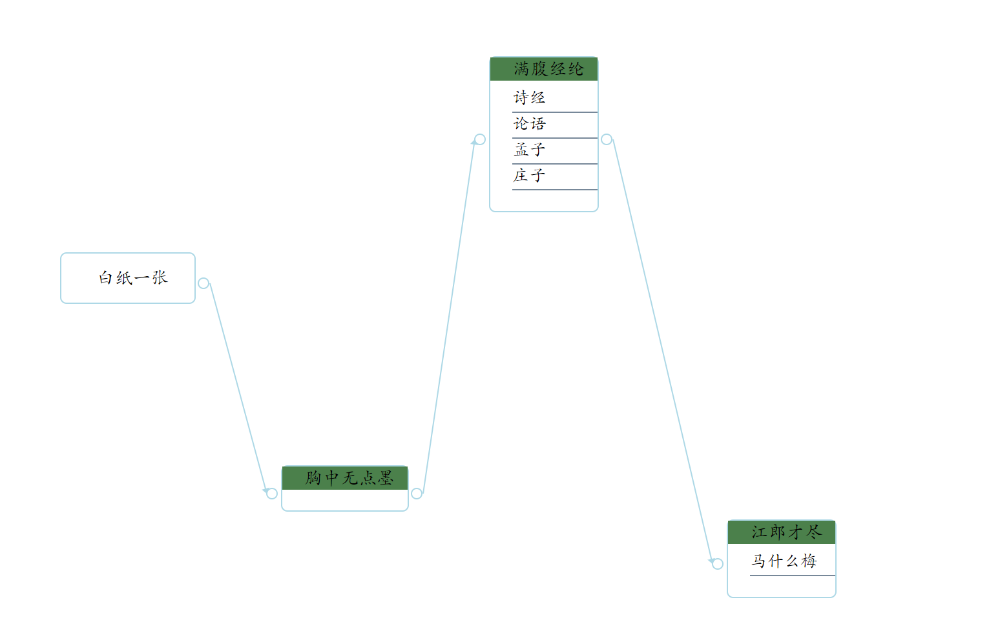

# MetricFlow.js


## 介绍

MetricFlow是一个前端画图的javascript库，可用于构建可拖拽、可灵活定义的数据流图、任务流图、知识图谱展示等


## 展示

[参考demo6.html](demo/demo6.html)


[参考demo7.html](demo/demo7.html)


## 文档

### 快速上手

#### 1. 创建画布

创建画布只需要定义`div`标签即可，并声明画布的`width`和`height`

```html
<div id="graph" height="700px" width="1100px" ></div>
```

#### 2. 创建节点

```javascript
/*在画布上创建图*/
let metricFlow = MetricFlow("graph")
/*定义节点数据*/
let nodeData= {
    "id":"primaryKey",//id在全局中不能重复，否则会被覆盖
    "title":{'name':"运行时间统计"},
    "data":[
       {'name':'方法：IndexController#method1'},
       {'name':'平均耗时：0.333ms'},
     ]
};
/*在(20,200)坐标上创建一个节点*/
let node1 = metricFlow.createNode(nodeData,10,200);
/*或者直接在nodeData中定义位置x和y属性，然后*/
/*metricFlow.createNode(nodeData);*/
```

[创建节点demo-demo1.html](demo/demo1.html)


#### 3. 创建连线

```javascript
let metricFlow = MetricFlow("graph")
let node1Data= {
    "x":10,
    "y":200,
    "id":"node1",
    "title":{'name':"运行时间统计"},
    "data":[
       {'name':'方法：IndexController#method1'},
       {'name':'平均耗时：0.333ms'},
     ]
};
let node1 = metricFlow.createNode(node1Data);

let node2Data= {
    "x":300,
    "y":200,
    "id":"node2",
    "title":{'name':"运行时间统计"},
    "data":[
       {'name':'方法：IndexController#method1'},
       {'name':'平均耗时：0.333ms'},
     ]
};
let node2 = metricFlow.createNode(node2Data);
/*连接两个节点*/
metricFlow.createLink(node1,node2);
```

或者直接在末尾节点中指定`from`属性，无需`metricFlow.createLink(node1,node2);`

```javascript
let metricFlow = MetricFlow("graph")
let node1Data= {
    "x":10,
    "y":200,
    "id":"node1",
    "title":{'name':"运行时间统计"},
    "data":[]
};
let node1 = metricFlow.createNode(node1Data);

let node2Data= {
    "x":300,
    "y":200,
    "id":"node2",
    "from":"node1",
    "title":{'name':"运行时间统计"},
    "data":[]
};
let node2 = metricFlow.createNode(node2Data);
```

[创建连线demo(两个节点)-demo2.html](demo/demo2.html)

[创建连线demo(三个节点)-demo3.html](demo/demo3.html)

#### 4. 批量创建节点

批量创建节点有两种方式，第一种使用list创建，并在每个节点数据中指定`from`属性即可创建关系：

```javascript

            let metricFlow = MetricFlow("graph")

            /*定义节点数据*/
            let node1Data= {
                "x":20,
                "y":200,
                "id":"node1",
                "title":{'name':"节点1"}
            };

            let node2Data= {
                "x":300,
                "y":50,
                "id":"node2",
                "from":"node1",
                "title":{'name':"节点2"}
            };
            let node3Data= {
                "x":300,
                "y":300,
                "id":"node3",
                "from":"node1",
                "title":{'name':"节点3"}
            };
            let nodes = [node1Data,node2Data,node3Data];
            metricFlow.createNodes(nodes);
```

[批量创建节点-demo8.html](demo/demo8.html)

第二种使用children属性创建，根节点的x和y需指定，其余子节点会自动向右排列

```javascript
let nodes= {
            "x":20,
            "y":200,
             ...
            "children":[
                {
                    "id":"node3",
                     ...
                    "children":[
                        {...}
                    ]
                },
            ]
        };

metricFlow.createNodes(nodes);

```

[批量创建节点-demo9.html](demo/demo9.html)


### 样式定义

#### 1. 更改节点样式

节点由三部分组成，分别是 标题、元素集和剩余的背景，每一个部分都支持两种样式定义方式：

第一种是沿用了css的样式，在数据上添加`style`即可，如，更改整个节点的边框颜色和粗细：

```javascript
let node2Data= {
    "id":"node2",
    "style":"border-color:red;border-width:2px;",
    "title":{'name':"运行时间统计"},
    "data":[
       {'name':'方法：IndexController#method1'},
       {'name':'平均耗时：0.333ms'},
     ]
};
```


第二种是提取了`background-color`和`border-color`两个样式，可以单独配置

```javascript
let node2Data= {
    "id":"node2",
    "background-color":"red",
    "border-color":"red",
    "title":{'name':"运行时间统计"},
    "data":[
       {'name':'方法：IndexController#method1'},
       {'name':'平均耗时：0.333ms'},
     ]
};
```

[样式定义demo-demo4.html](demo/demo4.html)

#### 2. 更改标题样式

```javascript
let node2Data= {
    "id":"node2",
    "title":{'name':"运行时间统计","style":"background-color:red;border-color:red;font-size:15px;"},
    "data":[
       {'name':'方法：IndexController#method1'},
       {'name':'平均耗时：0.333ms'},
     ]
};
```

[样式定义demo-demo4.html](demo/demo4.html)

#### 3. 更改元素样式

```javascript
let node2Data= {
    "id":"node2",
    "title":{'name':"运行时间统计"},
    "data":[
       {'name':'方法：IndexController#method1',"style":"font-size:10px;"},
       {'name':'平均耗时：0.333ms',"style":"font-size:10px;"},
     ]
};
```

[样式定义demo-demo4.html](demo/demo4.html)


### 连线配置

连线位置目前仅支持偏移量定义，可在创建`MetricFlow`时定义

连线分为起始点和终点，可设置全局的起始点的偏移位置，主要考虑前端框架使用较为复杂时css冲突所导致位置偏移的校正

```javascript
let options = {
                'link-start-offsetx':1,//起始点向右偏移一个单位
                'link-start-offsety':-1,//起始点向上偏移一个单位
                'link-end-offsetx':-1,
                'link-end-offsety':-1,
                'link-width-offset':-1,//线段粗细减小1个单位
                'link-color':"blue", //更改线段颜色
            };
let metricFlow = MetricFlow("graph",options)
```

[连线位置demo-demo5.html](demo/demo5.html)


### 节点事件

支持基本的鼠标事件，如`click`、`dblclick`、`mousedown`、`mouseup`等，事件在对应节点身上配置即可：

```javascript
let node1Data= {
            "id":"primaryKey",
            "title":{'name':"双击"},
            'click':"sinclick", //单击 sinclick为函数名
            'dblclick':"doubleClick",//双击
            "data":[
               {'name':'方法：IndexController#method1'},
               {'name':'平均耗时：0.333ms'},
             ]
        };
```

[连线位置demo-demo11.html](demo/demo5.html)


## 版本说明

> V1.0：创建节点；连线；样式定义

## 版权说明

> 1.本项目版权属作者所有，并使用 Apache-2.0进行开源；
>
> 2.您可以使用本项目进行学习、商用或者开源，但任何使用了本项目的代码的软件和项目请尊重作者的原创权利；
>
> 3.如果您使用并修改了本项目的源代码，请注明修改内容以及出处；
>
> 4.其他内容请参考Apache-2.0


