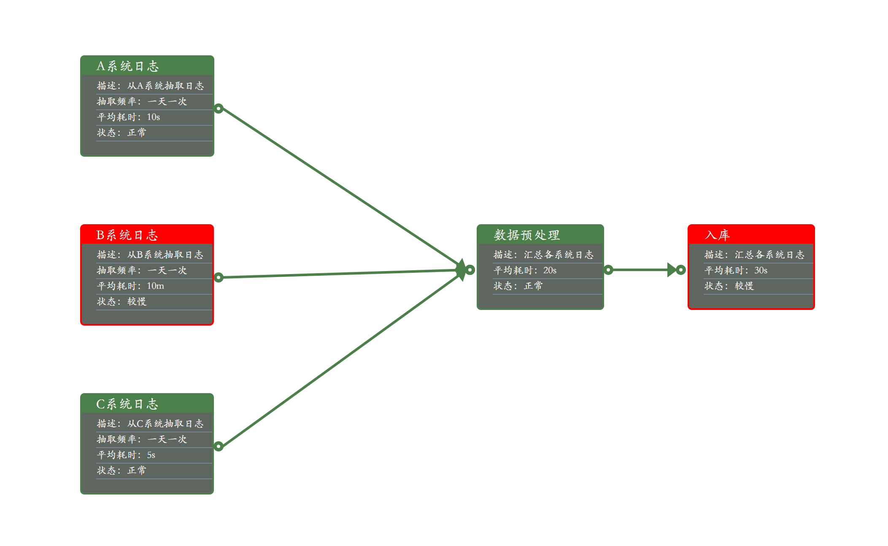

# MetricFlow.js

## 介绍

MetricFlow是一个前端画图的javascript库，可用于构建数据流图、任务流图、知识图谱展示等

## 文档

[先去看demo吧](demo)

## 展示

## 版本说明

> V1.0：基本功能

## 版权说明

> 1.本项目版权属作者所有，并使用 Apache-2.0进行开源；
>
> 2.您可以使用本项目进行学习、商用或者开源，但任何使用了本项目的代码的软件和项目请尊重作者的原创权利；
>
> 3.如果您使用并修改了本项目的源代码，请注明修改内容以及出处；
>
> 4.其他内容请参考Apache-2.0

