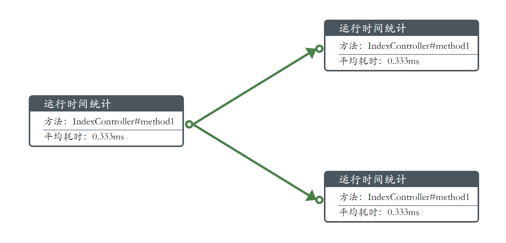
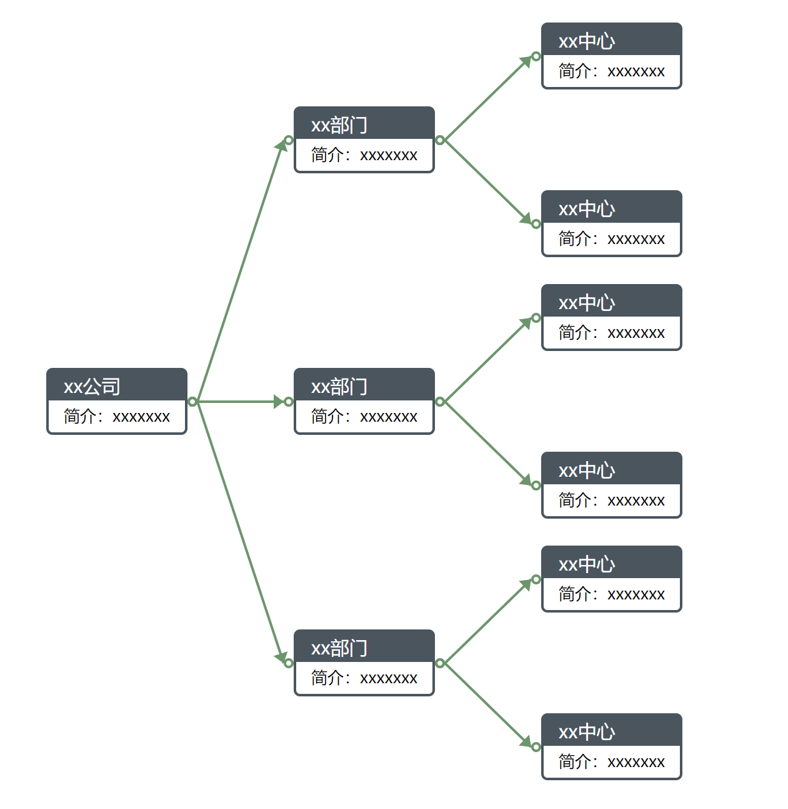

# MetricFlow.js


---

<div >
    
    
    
    <h4>MetricFlow是一个前端画图的javascript库，可用于构建可拖拽、可灵活定义的流程图、网络图、知识图谱展示等</h4>
</div>


> python版本请移步[ndraw](https://gitee.com/huoyo/ndraw.git)


## 展示

[参考demo6.html](demo/demo6.html)


### 快速上手

#### 0.引入

* 原生引入

下载发行版本

```html
script src="metricflow.js"></script>-->
```

* npm安装

>npm install metricflow


```html
let MetricFlow = require("metricflow")
```


#### 1. 创建画布

创建画布只需要定义`div`标签即可，并声明画布的`width`和`height`

```html
<div id="graph" height="700px" width="1100px" ></div>
```

#### 2. 创建节点

```javascript
/*在画布上创建图*/
let metricFlow = MetricFlow("graph")
/*定义节点数据*/
let nodeData= {
    "id":"primaryKey",//id在全局中不能重复，否则会被覆盖
    "title":{'name':"运行时间统计"},
    "data":[
       {'name':'方法：IndexController#method1'},
       {'name':'平均耗时：0.333ms'},
     ]
};
/*在(20,200)坐标上创建一个节点*/
let node1 = metricFlow.createNode(nodeData,10,200);
/*或者直接在nodeData中定义位置x和y属性，然后*/
/*metricFlow.createNode(nodeData);*/
```

[创建节点demo1.html](demo/demo1.html)


#### 3. 创建连线

```javascript
let metricFlow = MetricFlow("graph")
let node1Data= {
    "x":10,
    "y":200,
    "id":"node1",
    "title":{'name':"运行时间统计"},
    "data":[
       {'name':'方法：IndexController#method1'},
       {'name':'平均耗时：0.333ms'},
     ]
};
let node1 = metricFlow.createNode(node1Data);

let node2Data= {
    "x":300,
    "y":200,
    "id":"node2",
    "title":{'name':"运行时间统计"},
    "data":[
       {'name':'方法：IndexController#method1'},
       {'name':'平均耗时：0.333ms'},
     ]
};
let node2 = metricFlow.createNode(node2Data);
/*连接两个节点*/
metricFlow.createLink(node1,node2);
```

或者直接在末尾节点中指定`from`属性，无需`metricFlow.createLink(node1,node2);`

```javascript
let metricFlow = MetricFlow("graph")
let node1Data= {
    "x":10,
    "y":200,
    "id":"node1",
    "title":{'name':"运行时间统计"},
    "data":[]
};
let node1 = metricFlow.createNode(node1Data);

let node2Data= {
    "x":300,
    "y":200,
    "id":"node2",
    "from":"node1",//from的值可以是string 也可以是数组
    "title":{'name':"运行时间统计"},
    "data":[]
};
let node2 = metricFlow.createNode(node2Data);
```

[创建连线demo(两个节点)-demo2.html](demo/demo2.html)


[创建连线demo(三个节点)-demo3.html](demo/demo3.html)


#### 4. 批量创建节点

批量创建节点有两种方式，第一种使用list创建，并在每个节点数据中指定`from`属性即可创建关系：

```javascript

            let metricFlow = MetricFlow("graph")

            /*定义节点数据*/
               let node1Data= {
                "x":20,
                "y":200,
                "id":"node1",
                "title":{'name':"节点1"}
            };

            let node2Data= {
                "x":300,
                "y":50,
                "id":"node2",
                "from":"node1",
                "title":{'name':"节点2"}
            };
            let node3Data= {
                "x":300,
                "y":300,
                "id":"node3",
                "from":"node1",
                "title":{'name':"节点3"}
            };
            let node4Data= {
                "x":500,
                "y":200,
                "id":"node4",
                "from":['node2','node3'],
                "title":{'name':"节点3"},
                "data":[
                    {'name':"1.xxxx"},
                    {'name':"2.xxxx"},
                ]
            };
            let nodes = [node1Data,node2Data,node3Data,node4Data];
            metricFlow.createNodes(nodes);
```

[批量创建节点-demo7.html](demo/demo7.html)


第二种使用children属性创建，根节点的x和y需指定，其余子节点默认会自动向右排列

```javascript
let nodes= {
            "x":20,
            "y":200,
             ...
            "children":[
                {
                    "id":"node3",
                     ...
                    "children":[
                        {...}
                    ]
                },
            ]
        };

metricFlow.createNodes(nodes);

```
[批量创建节点-demo9.html](demo/demo9.html)



自动创建的时候如果节点间距不合适，可调整

```javascript
let options = {
                'node-distance-offsetx':5,//左右间距+5
                'node-distance-offsety':-5//上下间距-5
            };
let metricFlow = MetricFlow("graph",options)

```

如果需要自动向下排列，可调整

```javascript
let options = {
        "flow":"vertical" //horizontal水平排列  vertical垂直排列
    };
let metricFlow = MetricFlow("graph",options)

```

[垂直排列-demo12.html](demo/demo12.html)


自动创建的时候如果数据格式不匹配，又不想遍历处理，可传入函数调整

```javascript
function format(data){
    data['title'] = {'name':"更改title的名字"};
    return data;
}
metricFlow.createNodes(nodes,format);
```

[批量创建节点-demo9.html](demo/demo9.html)


### 样式定义

#### 1. 更改节点样式

在节点上添加`style`属性即可

```javascript
let node2Data= {
    "id":"node2",
    "style":{
                    'border-color':'black',//边框颜色
                    'title-color':'black',//标题背景颜色
                    'title-font-color':'white',//标题字体颜色
                    'title-font-size':'13px',//标题字体大小
                    'data-color':'white',//数据背景颜色
                    'data-font-size':'13px',//数据字体大小
                    'data-font-color':'red',//数据字体颜色
                }
    "title":{'name':"运行时间统计"},
    "data":[
       {'name':'方法：IndexController#method1'},
       {'name':'平均耗时：0.333ms'},
     ]
};
```


单个节点添加不方便可以批量

```javascript
metricFlow.createNodes(nodeList,addColors);
 function addColors(data) {
        data['style'] = {
            'border-color':'black',//边框颜色
            'title-color':'black',//标题背景颜色
            'title-font-color':'white',//标题字体颜色
            'title-font-size':'13px',//标题字体大小
            'data-color':'white',//数据背景颜色
            'data-font-size':'13px',//数据字体大小
            'data-font-color':'red',//数据字体颜色
        }
        return data
    }
```


[样式定义demo-demo4.html](demo/demo4.html)


### 连线配置

连线位置目前仅支持偏移量定义，可在创建`MetricFlow`时定义

连线分为起始点和终点，可设置全局的起始点的偏移位置，主要考虑前端框架使用较为复杂时css冲突所导致位置偏移的校正

```javascript
let options = {
                'link-start-offsetx':1,//起始点向右偏移一个单位
                'link-start-offsety':-1,//起始点向上偏移一个单位
                'link-end-offsetx':-1,
                'link-end-offsety':-1,
                'link-width-offset':-1,//线段粗细减小1个单位
                'link-color':"blue", //更改线段颜色
            };
let metricFlow = MetricFlow("graph",options)
```

[连线位置demo-demo5.html](demo/demo5.html)


### 节点事件

支持基本的鼠标事件，如`click`、`dblclick`、`mousedown`、`mouseup`等，与原生js一致，事件在对应节点身上配置即可：

```javascript
let node1Data= {
            "id":"primaryKey",
            "title":{'name':"双击"},
            'click':"sinclick", //单击 sinclick为函数名
            'dblclick':"doubleClick",//双击
            "data":[
               {'name':'方法：IndexController#method1'},
               {'name':'平均耗时：0.333ms'},
             ]
        };
```

[节点事件demo-demo11.html](demo/demo11.html) [节点事件demo-demo13.html](demo/demo13.html)


## 版本说明

> V1.0.0：创建节点；连线；样式定义；鼠标事件
>
> V1.0.1：新增自动向下布局

## 版权说明

> 1.本项目版权属作者所有，并使用 Apache-2.0进行开源；
>
> 2.您可以使用本项目进行学习、商用或者开源，但任何使用了本项目的代码的软件和项目请尊重作者的原创权利；
>
> 3.如果您使用并修改了本项目的源代码，请注明修改内容以及出处；
>
> 4.其他内容请参考Apache-2.0


